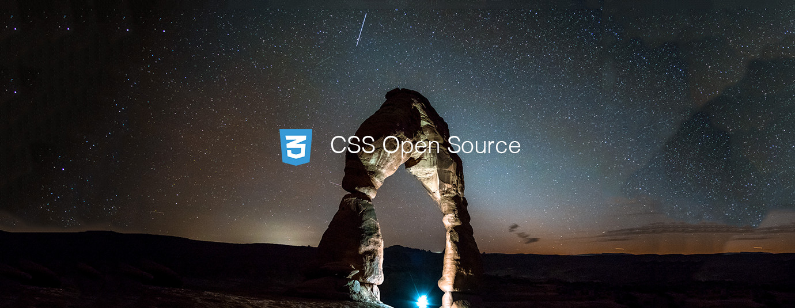

# CSS Top 10 Open Source Projects (v.Jun 2018)

</a>

For the past month, we ranked nearly 250 JavaScript Open Source Projects to pick the Top 10. 
We compared projects with new or major release during this period. Mybridge AI ranks projects based on a variety of factors to measure its quality for professionals.

* Average number of Github stars in this edition: 367 ⭐️
* Topics: Critters Webpack, Color Picker, CSS Reset, Box shadow, Flexbox, Linux Desktop, React, Webpack Plugin, Refactoring

Open source projects can be useful for programmers. Hope you find an interesting project that inspires you.

 

### Course of the month:

[A) Beginners: CSS FLexbox Tutorial with Website Projects.](http://bit.ly/2LTfC4y) [129 recommends, 4.8/5 stars]

[B) CSS — The Complete Guide (incl. Flexbox, Grid & Sass)](http://bit.ly/2MnOwnv) [867 recommends, 4.8/5 stars]

 

## Rank 1
### [Critters: A Webpack plugin to inline your critical CSS and lazy-load the rest [★1632]](https://github.com/GoogleChromeLabs/critters?utm_source=mybridge&utm_medium=blog&utm_campaign=read_more)

 

## Rank 2
### [Pickr: Flat, simple and hackable Color-Picker. No dependencies, no jQuery. Compatible with all CSS Frameworks e.g. Bootstrap, Materialize. [★1029]](https://github.com/Simonwep/pickr?utm_source=mybridge&utm_medium=blog&utm_campaign=read_more)

 

## Rank 3
### [CSS-Micro-Reset: Minimal barebone CSS Reset [★300]](https://github.com/vladocar/CSS-Micro-Reset?utm_source=mybridge&utm_medium=blog&utm_campaign=read_more)

 

## Rank 4
### [Box-shadows.css: :pisces: A cross-browser collection of CSS box-shadows [★203]](https://github.com/madeas/box-shadows.css?utm_source=mybridge&utm_medium=blog&utm_campaign=read_more)

 

## Rank 5
### [Flexy: A minimal CSS framework made with Flex [★93]](https://github.com/vladocar/flexy?utm_source=mybridge&utm_medium=blog&utm_campaign=read_more)

 

## Rank 6
### [Strawberry: A new flexbox based CSS micro-framework. A set of common flexbox's utilities focused on making your life easier and faster with nested flexboxes. [★52]](https://github.com/jfet97/strawberry?utm_source=mybridge&utm_medium=blog&utm_campaign=read_more)

 

## Rank 7
### [Jadesktop: Linux desktop environment built with CSS, JavaScript and Python. [★232]](https://github.com/codesardine/Jadesktop?utm_source=mybridge&utm_medium=blog&utm_campaign=read_more)

 

## Rank 8
### [Horror: React HTML elements with CSS-in-JS [★72]](https://github.com/jxnblk/horror?utm_source=mybridge&utm_medium=blog&utm_campaign=read_more)

 

## Rank 9
### [Html-critical-webpack-plugin: A webpack plugin that will extract critical CSS. Now supports Webpack v4. [★154]](https://github.com/anthonygore/html-critical-webpack-plugin?utm_source=mybridge&utm_medium=blog&utm_campaign=read_more)

 

## Rank 10
### [Mort: Dead CSS detection [★57]](https://github.com/joereynolds/mort?utm_source=mybridge&utm_medium=blog&utm_campaign=read_more)

